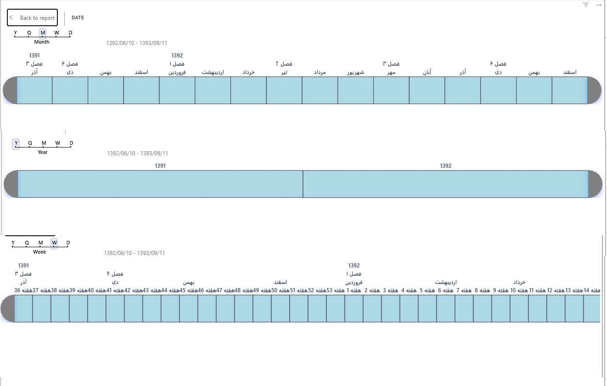

<div dir="rtl" align="right">

# 📅 Persian Jalali Date Slicer  
**اسلایسر تاریخ شمسی برای Power BI**

> یک اسلایسر گرافیکی و زیبا برای بازه‌های زمانی در Power BI — **فورک‌شده از Timeline Slicer مایکروسافت** و اکنون با پشتیبانی کامل از **تقویم هجری شمسی (جلالی)** و **رابط کاربری کاملاً فارسی**.  
>
> 👨‍💻 توسعه‌دهنده: **محمد علیپور**  
> 📧 ایمیل: worldmohammad@gmail.com



---

## 📖 معرفی

**Persian Jalali Date Slicer** یک اسلایسر گرافیکی بازهٔ زمانی برای Power BI است که بر پایهٔ [Timeline Slicer مایکروسافت](https://github.com/microsoft/powerbi-visuals-timeline) ساخته شده. این نسخهٔ فورک‌شده، تقویم **هجری شمسی (جلالی)** و یک **رابط کاربری کاملاً فارسی** را به آن افزوده است و آن را به ابزاری ایده‌آل برای تحلیل‌گران فارسی‌زبان و داده‌های مرتبط با ایران و افغانستان تبدیل می‌کند.

دیگر برای فیلتر کردن بازه‌های زمانی یا تغییر دانه‌بندی (روز/ماه/فصل/سال) نیازی به کلیک‌های بی‌پایان نیست. با همین کنترل سادهٔ لغزنده، فقط کلیک کنید و بکشید تا بازهٔ دلخواهتان انتخاب شود. می‌توانید بین نماهای **سال**، **فصل**، **ماه** و **روز** جابه‌جا شوید و در هر سطحی بازهٔ خود را برگزینید.  
*کلید SHIFT + کلیک* هم برای انتخاب سریع بازه کار می‌کند.

---

## ✨ تقویم شمسی و رابط فارسی — چه چیزهایی جدید است؟

این نسخه پشتیبانی بومی از **تقویم جلالی** را به ارمغان می‌آورد:

- 📆 **نمایش تاریخ شمسی** – تمام برچسب‌ها و مقادیر تاریخ (روز، ماه، فصل، سال) مطابق تقویم جلالی نشان داده می‌شوند.
- 🗓️ **نام ماه‌های فارسی** – فروردین، اردیبهشت، خرداد، تیر، مرداد، شهریور، مهر، آبان، آذر، دی، بهمن، اسفند.
- 🌱 **فصل‌های شمسی** – بهار، تابستان، پاییز، زمستان.
- 🎯 **سال‌های شمسی** – مانند ۱۴۰۲، ۱۴۰۳ و ...
- ⚙️ **تشخیص خودکار** – اسلایسر بر اساس تنظیمات محلی (Locale) ستون داده یا تنظیمات ناحیه‌ای Power BI، به‌طور خودکار تقویم شمسی را فعال می‌کند.
- 🇮🇷 **رابط کاملاً فارسی** – تمام راهنماها، دکمه‌ها و برچسب‌ها به فارسی روان ترجمه شده‌اند تا کاربران فارسی‌زبان تجربه‌ای یکپارچه و بومی داشته باشند.

اکنون می‌توانید داده‌هایتان را دقیقاً مطابق تقویم رسمی ایران و افغانستان فیلتر و تحلیل کنید.

---

## 🚀 ویژگی‌ها

- 📊 **انتخاب‌گر گرافیکی بازهٔ زمانی** – با کلیک و کشیدن، یک مقدار یا بازهٔ دلخواه را انتخاب کنید.
- 🔄 **دانه‌بندی انعطاف‌پذیر** – به‌سرعت بین نماهای سال، فصل، ماه و روز جابه‌جا شوید.
- 📅 **پشتیبانی کامل از تقویم شمسی** – نمایش تاریخ، نام ماه‌ها و فصل‌ها به فارسی.
- 🖥️ **رابط کاربری فارسی** – تمامی متون و عناصر بصری به فارسی ترجمه شده‌اند.
- 🎨 **ظاهر قابل شخصی‌سازی** – رنگ پس‌زمینه، رنگ انتخاب، اندازهٔ قلم و گزینه‌های قالب‌بندی فراوان.
- ⌨️ **میانبر صفحه‌کلید** – `SHIFT + کلیک` برای انتخاب بازه.
- 📌 بر پایهٔ نسخهٔ اصلی Microsoft Timeline Slicer، بهبودیافته و نگهداری‌شده توسط **محمد علیپور**.

---

## 📥 نصب و راه‌اندازی

### از Microsoft AppSource (نسخهٔ اصلی)
نسخهٔ پایهٔ مایکروسافت در AppSource موجود است:  
[](https://appsource.microsoft.com/en-us/product/power-bi-visuals/WA104380786)

### نسخهٔ فورک‌شده (با تقویم شمسی)
برای استفاده از این نسخه، می‌توانید سورس کد را از همین مخزن clone کرده و با ابزار `pbiviz` بستسپس فایل .pbiviz تولیدشده را به گزارش Power BI خود وارد کنید.

```bash
git clone https://github.com/worldmohammad/persian-jalali-date-slicer.git
cd persian-jalali-date-slicer
npm install
pbiviz package
